<picture>
  <source media="(prefers-color-scheme: dark)" srcset="https://raw.githubusercontent.com/openplan-labs/branding/main/assets/logo/mark-dark.svg">
  
</picture>

# planviz

[](https://github.com/openplan-labs/planviz/actions/workflows/ci.yml)
[](https://openplan-labs.github.io/planviz/)
[](https://pypi.org/project/planviz/)
[](LICENSE)

The figure library for [OpenPlan Labs](https://github.com/openplan-labs) —
grid maps, search animations, plan timelines and benchmark charts, in the
[Frontier](https://github.com/openplan-labs/branding) palette, light and dark
from the same call.

Planners not included. This draws results; it does not produce them. It knows
nothing about any solver's types: a grid is a 2-D array where truthy means
blocked, a path is a sequence of `(row, col)` pairs, and a benchmark series is
a mapping. Anything that can produce those can be plotted.

<picture>
  <source media="(prefers-color-scheme: dark)" srcset="docs/assets/gallery/search-dark.png">
  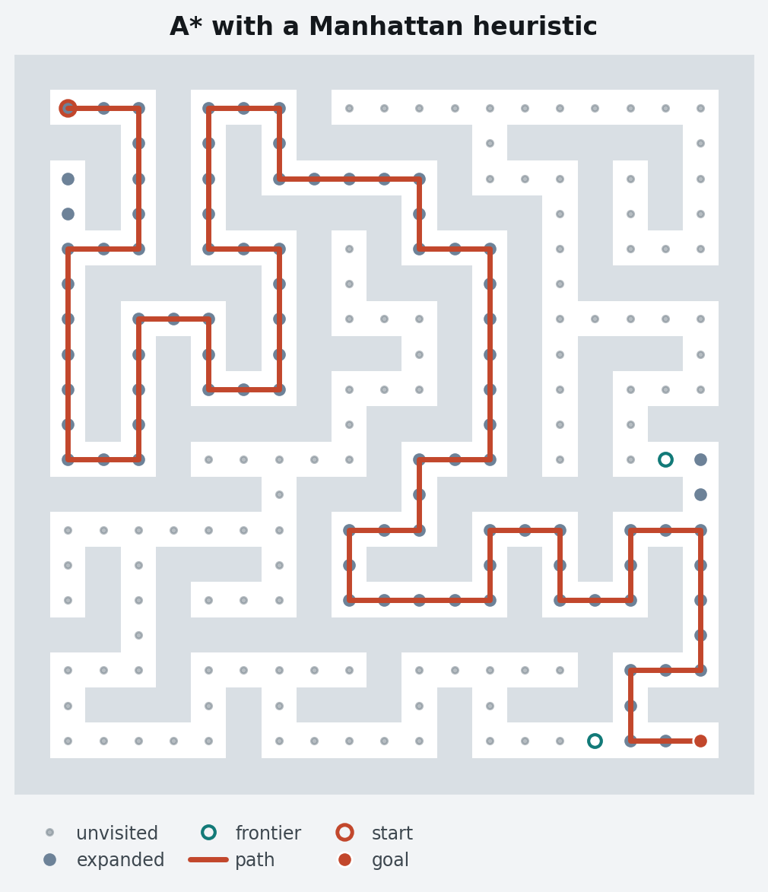
</picture>

That figure is the reason this package exists. Every search algorithm has the
same three sets — the nodes you **expanded**, the nodes on the **frontier**,
and the **path** you returned — so the brand's three colours *are* that legend,
and the three sets differ by shape as well as hue, which is what survives
greyscale printing and red/green colour blindness. Drawing it correctly by
hand, in four repositories, twice each for light and dark, was the duplication
this replaces.

## Install

```bash
pip install planviz
```

Two dependencies, both of which a plotting library obviously needs:
`matplotlib>=3.7` and `numpy>=1.24`. Python 3.10 or newer.

GIF and MP4 writing needs a little more:

```bash
pip install 'planviz[animation]'   # pillow for GIF, a bundled ffmpeg for MP4
```

## Quickstart

```python
import planviz

grid = [[0, 0, 0, 0], [0, 1, 1, 0], [0, 0, 0, 0]]   # truthy = blocked

ax = planviz.draw_search(
    expanded=[(0, 0), (1, 0), (2, 0), (2, 1)],
    frontier=[(0, 1), (2, 2)],
    path=[(0, 0), (1, 0), (2, 0), (2, 1), (2, 2)],
    grid=grid,
    dark=True,
)
planviz.save(ax, "search.png")
```

Four things hold across the whole API:

- **Importing `planviz` changes no matplotlib state.** The style is applied by
  `planviz.use_style(dark=...)`, or per-figure inside a `style_context` that
  restores rcParams on exit. A solver library can depend on this without
  repainting its user's notebook.
- **Every figure function takes `dark: bool = False` and an optional `ax=`,**
  so light and dark variants come from one call and figures compose into
  panels.
- **Nothing is saved or shown for you.** Functions return the `Axes` they drew
  on (or the `Figure`, for multi-panel figures). `planviz.save(...)` is the
  explicit write.
- **The brand ships inside the wheel.** `planviz/tokens.py` and
  `planviz/styles/frontier.mplstyle` are generated from
  [`openplan-labs/branding`](https://github.com/openplan-labs/branding) and
  checked for drift in CI, so nothing looks up a repository at runtime and a
  figure rendered offline matches one rendered on a laptop.

To style figures you draw yourself with the same values:

```python
import matplotlib.pyplot as plt
from planviz import tokens

with planviz.style_context(dark=False) as t:
    fig, ax = plt.subplots()
    ax.plot(xs, ys, color=t.path)          # the solution: the only warm value
    ax.plot(xs, others, color=t.agent(0))  # supporting series: the agent ramp
```

## Gallery

Every image below is generated by [`examples/gallery.py`](examples/gallery.py)
from synthetic data, in both schemes, and is regenerated in CI. The full
gallery with code for each figure is at
[openplan-labs.github.io/planviz/gallery](https://openplan-labs.github.io/planviz/gallery/).

### Grids and agents

| | |
| :--: | :--: |
| <picture><source media="(prefers-color-scheme: dark)" srcset="docs/assets/gallery/grid-dark.png">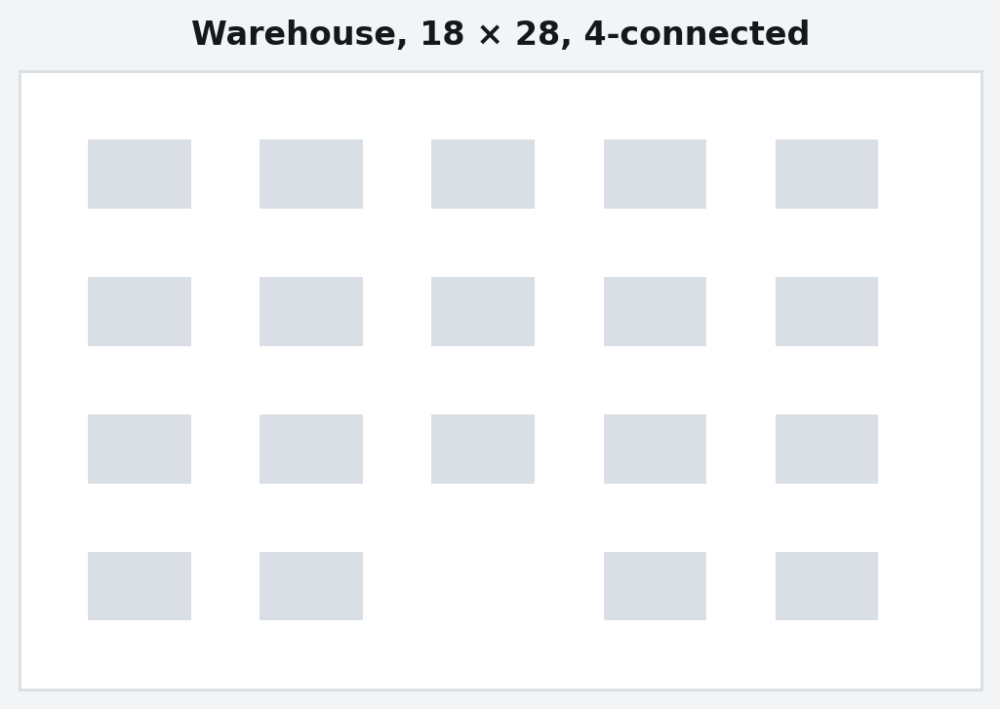</picture><br>`draw_grid` | <picture><source media="(prefers-color-scheme: dark)" srcset="docs/assets/gallery/paths-dark.png">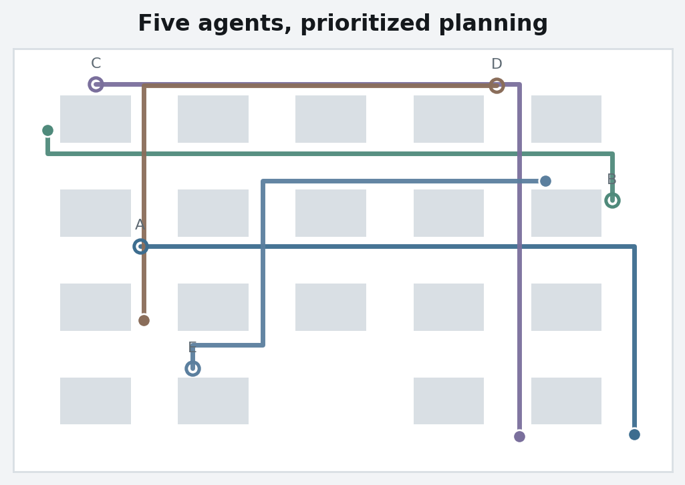</picture><br>`draw_paths` |
| <picture><source media="(prefers-color-scheme: dark)" srcset="docs/assets/gallery/paths-highlight-dark.png">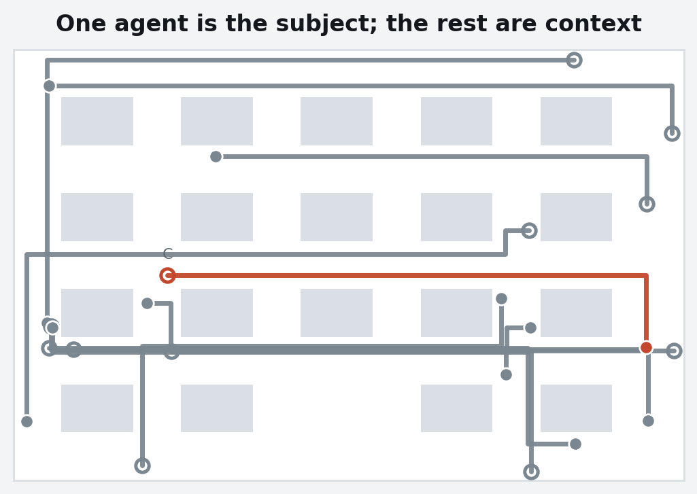</picture><br>`draw_paths(highlight=...)` | <picture><source media="(prefers-color-scheme: dark)" srcset="docs/assets/gallery/congestion-dark.png">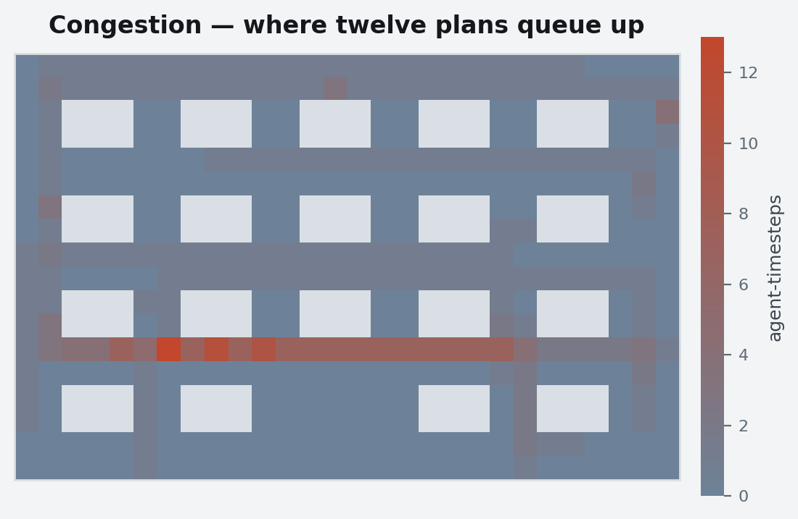</picture><br>`draw_heatmap` |

<picture>
  <source media="(prefers-color-scheme: dark)" srcset="docs/assets/gallery/search-animation-dark.gif">
  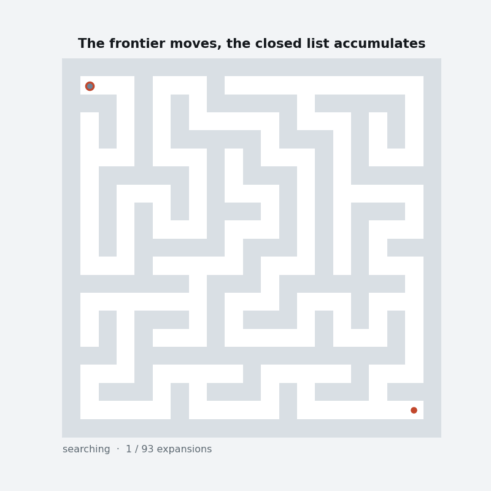
</picture>
<picture>
  <source media="(prefers-color-scheme: dark)" srcset="docs/assets/gallery/paths-animation-dark.gif">
  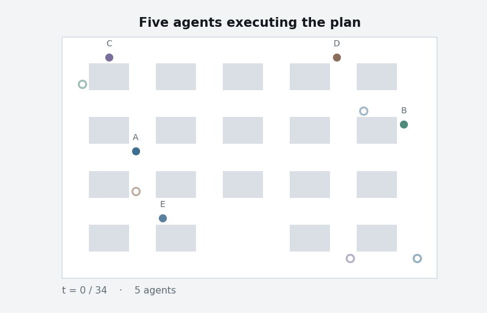
</picture>

`animate_search` and `animate_paths`. The frontier moves, the expanded set
accumulates, and the path appears once at the end and stays — the accumulated
closed list *is* the cost of the search, so erasing it hides the thing the
figure is arguing about. GIFs are capped at 12 fps and 800 px wide, because
they are read in a README on a train.

### Search progress

| | |
| :--: | :--: |
| <picture><source media="(prefers-color-scheme: dark)" srcset="docs/assets/gallery/search-progress-dark.png">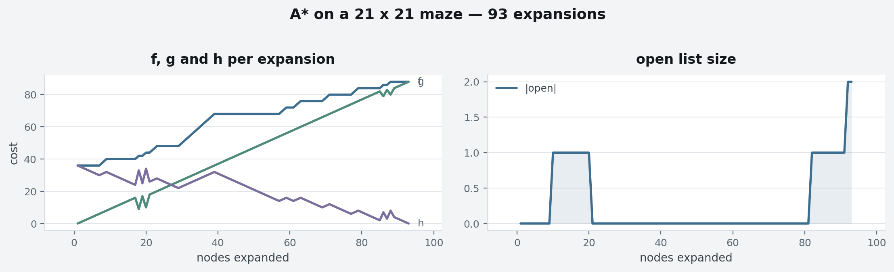</picture><br>`search_panels` | <picture><source media="(prefers-color-scheme: dark)" srcset="docs/assets/gallery/wavefront-dark.png">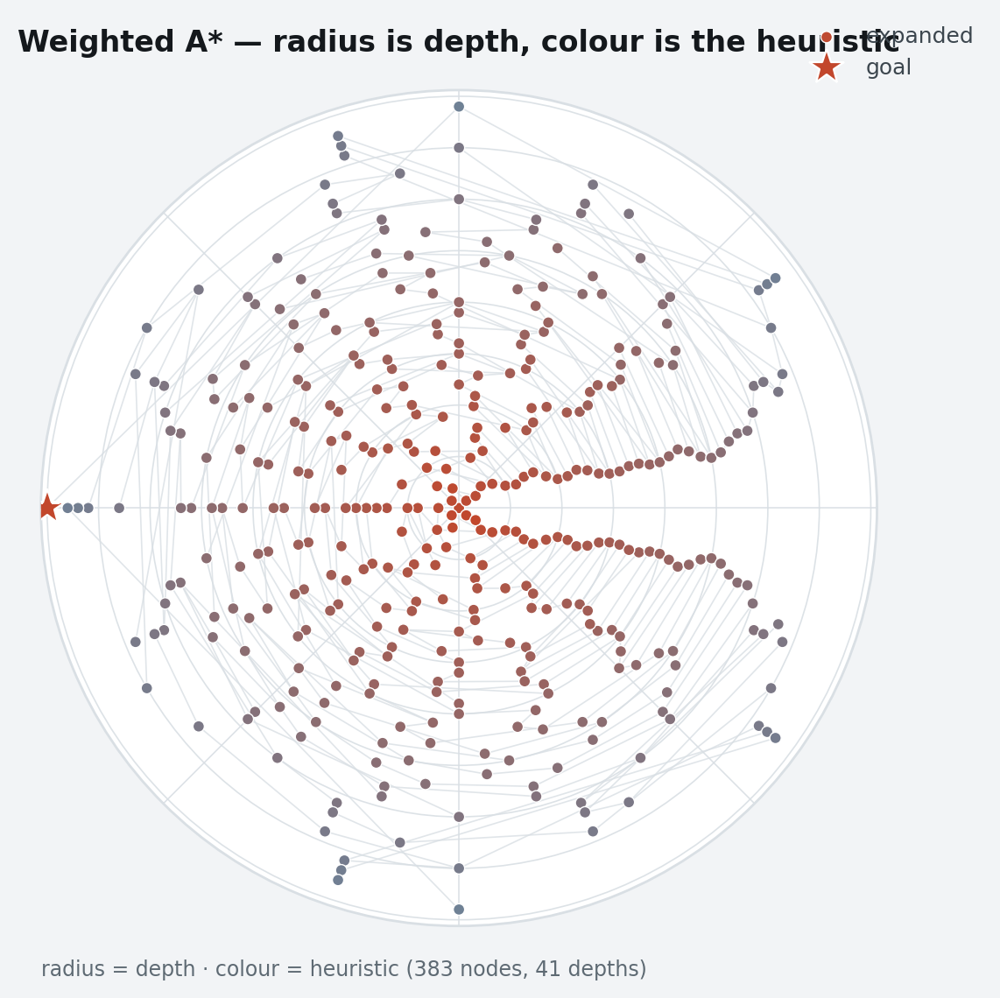</picture><br>`radial_wavefront` |
| <picture><source media="(prefers-color-scheme: dark)" srcset="docs/assets/gallery/plan-timeline-dark.png">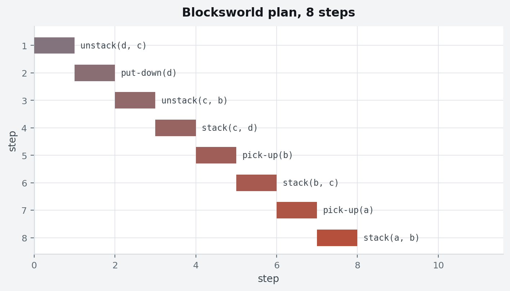</picture><br>`plan_timeline` | <picture><source media="(prefers-color-scheme: dark)" srcset="docs/assets/gallery/agent-timeline-dark.png">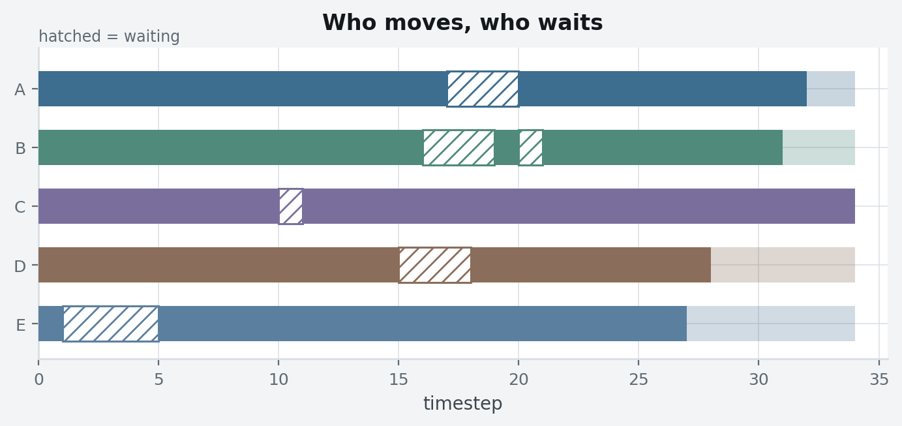</picture><br>`plan_timeline(timeline_from_paths(...))` |

### Benchmarks

| | |
| :--: | :--: |
| <picture><source media="(prefers-color-scheme: dark)" srcset="docs/assets/gallery/scaling-dark.png">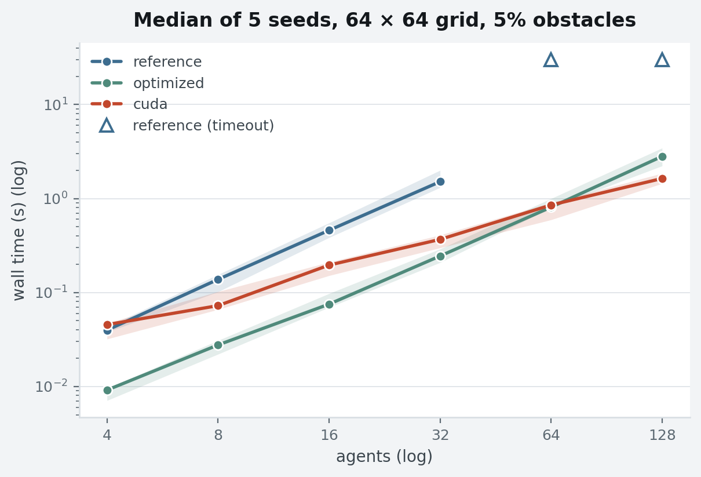</picture><br>`scaling_curve` | <picture><source media="(prefers-color-scheme: dark)" srcset="docs/assets/gallery/success-dark.png">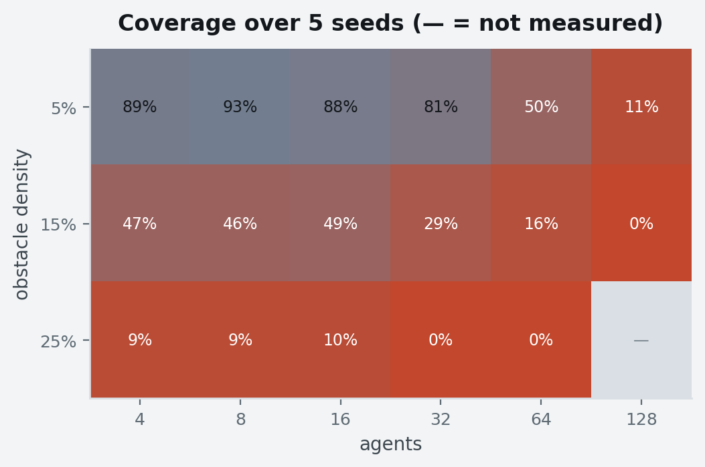</picture><br>`success_heatmap` |
| <picture><source media="(prefers-color-scheme: dark)" srcset="docs/assets/gallery/phases-dark.png">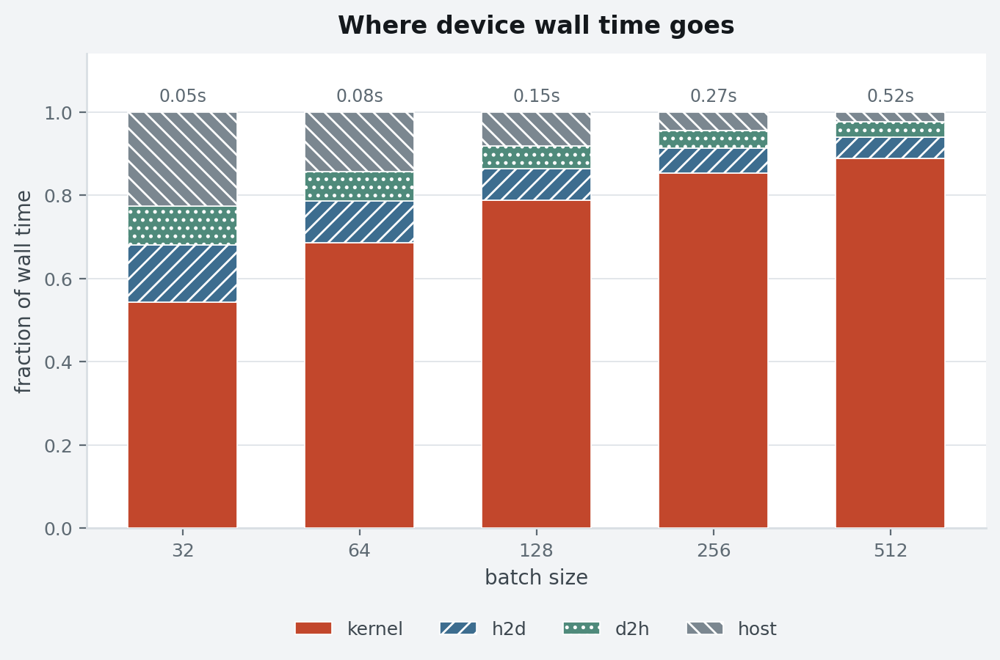</picture><br>`phase_breakdown` | <picture><source media="(prefers-color-scheme: dark)" srcset="docs/assets/gallery/crossover-dark.png">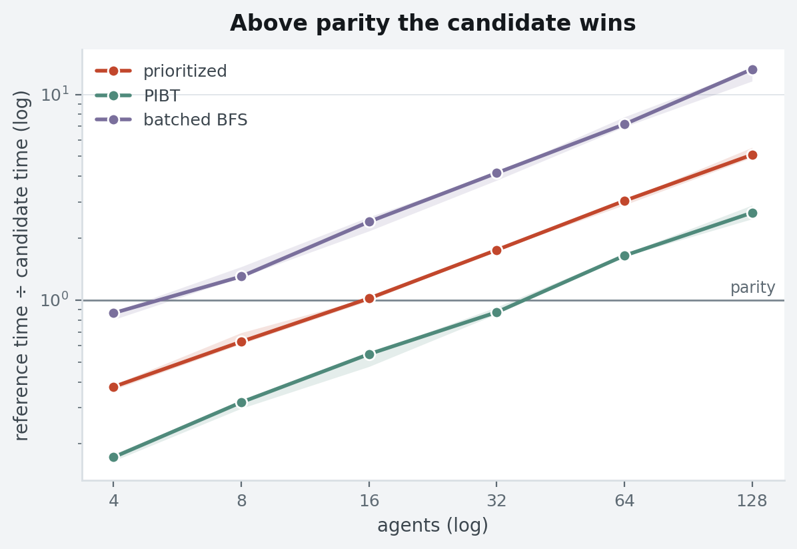</picture><br>`crossover_plot` |

## The API

| | |
| :--- | :--- |
| **Style** | `use_style(dark=False)`, `style_context(dark=False)`, `STYLE_PATH` |
| **Tokens** | `planviz.tokens` — `LIGHT`, `DARK`, `AGENT_RAMP`, `Tokens.agent(i)`, `Tokens.sequential()` |
| **Grids and agents** | `draw_grid`, `draw_paths`, `draw_search`, `draw_heatmap`, `animate_paths`, `animate_search` |
| **Search progress** | `search_progress`, `search_panels`, `radial_wavefront`, `plan_timeline`, `timeline_from_paths`, `Step` |
| **Benchmarks** | `scaling_curve`, `success_heatmap`, `phase_breakdown`, `throughput_curve`, `crossover_plot` |
| **Output** | `save`, `save_animation`, `to_jshtml` |

Full signatures: [API reference](https://openplan-labs.github.io/planviz/api/).

## What it does not do

- **No solver adapters.** There is no `plot_solution(pymapf.Solution)`. Callers
  pass arrays and mappings, which is what keeps one library serving four
  repositories with different problem types.
- **No grouped-bar chart and no parity scatter** yet. `pymapf`'s
  `plot_cost_comparison` and `cuplan`'s `_fig_quality` have no home here in
  1.0.0; see [migration](https://openplan-labs.github.io/planviz/migration/).
- **No 3-D space-time cube.** `pymapf.viz.plot_spacetime` stays where it is.
- **No live views.** `LiveSolveView` and jupyddl's `LiveSearchPlot` are solver
  observers, not figures; they belong with the solver they observe.
- **No interactivity, no web renderer.** Static matplotlib output, plus GIF and
  MP4.

## Who uses this

| Repository | What it draws with planviz |
| :--- | :--- |
| [pymapf](https://github.com/openplan-labs/pymapf) | grid maps, multi-agent routes, plan animations, congestion heatmaps, move/wait timelines, scaling charts |
| [cuda-planning](https://github.com/openplan-labs/cuda-planning) | the Experiments figures: scaling curves with min–max bands, coverage heatmaps, device phase breakdowns, throughput saturation, crossovers |
| [PythonPDDL](https://github.com/openplan-labs/PythonPDDL) | `--plot` search progress, `--tree` radial wavefront, `--plan-plot` plan timelines |
| [openplan-bench](https://github.com/openplan-labs/openplan-bench) | the cross-repository comparison charts |

[`docs/migration.md`](docs/migration.md) maps each of their existing functions
onto a `planviz` call, one line at a time.

## Contributing

Bug reports, figures that are wrong, and figures that are missing are all
welcome — see [CONTRIBUTING.md](CONTRIBUTING.md). The binding constraint is
[`brand/figures.md`](https://github.com/openplan-labs/branding/blob/main/brand/figures.md);
the parts of it this library enforces are summarised in
[design rules](https://openplan-labs.github.io/planviz/design-rules/).

MIT licensed.
